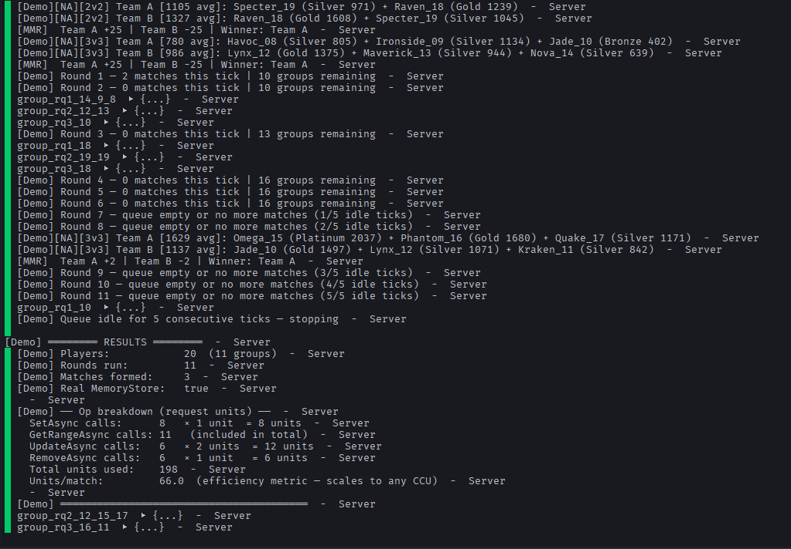
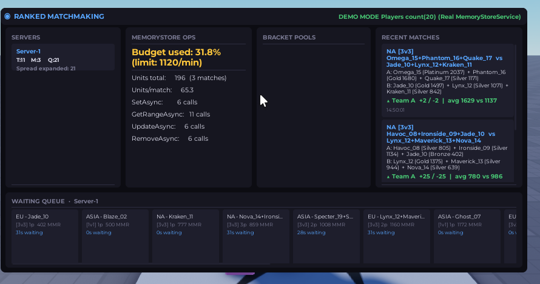
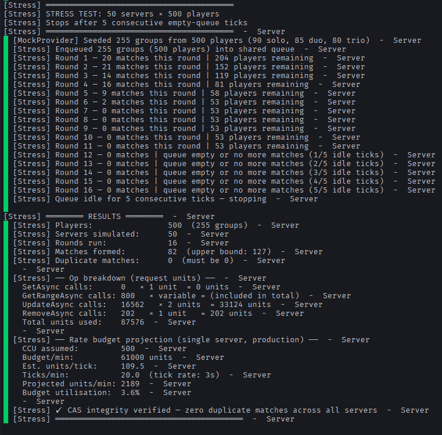
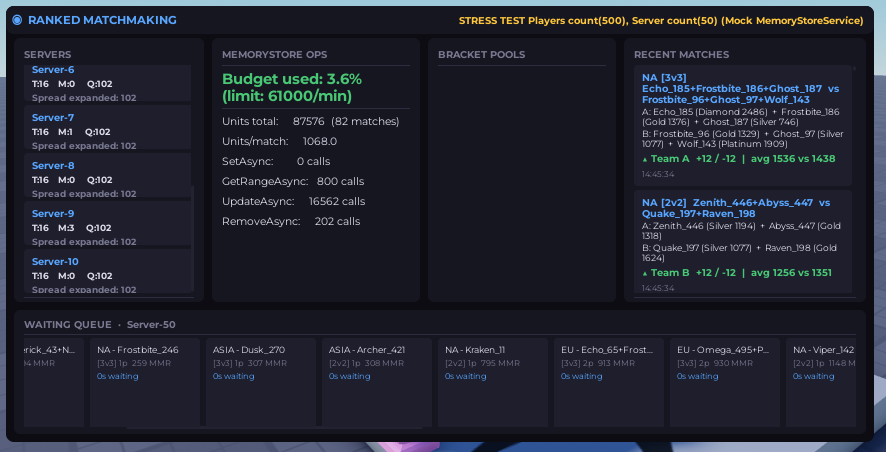

# Ranked Matchmaking System — Roblox / Luau

A production-ready ranked matchmaking system built on **Roblox MemoryStore**, demonstrated entirely with mock data. No live game required to evaluate the architecture.

---

## What it does

- **Multi-bracket matchmaking** — players queue for 1v1, 2v2, or 3v3 independently of their party size. A solo player can queue for 3v3 and get paired with other groups to fill the team.
- **Team assembly** — greedy packing algorithm fills exactly N player slots per team from any combination of solo/duo/trio groups in the same bracket.
- **MMR-based pairing** — matches within a configurable spread window (±150 MMR base), expanding automatically the longer a player waits (10 MMR/sec, capped at ±500).
- **Region separation** — queue is bucketed by region (NA / EU / ASIA) before bracket bucketing. Players never match cross-region. Region is shown on every match log entry and queue chip in the dashboard.
- **Cross-server CAS safety** — every match claim uses `UpdateAsync` atomically. If two servers race for the same player, only one wins. Zero duplicate matches guaranteed.
- **Live dashboard** — client-side UI shows per-server stats, bracket pools, MemoryStore op costs, budget utilisation (units/match), and a scrollable infinite match history with region and timestamp per entry.
- **Stress test** — simulates N concurrent servers all hitting the same shared queue, verifies zero duplicates under contention, and reports real MemoryStore request-unit usage.

---

## Architecture

```
┌─────────────────────────────────────────────────────┐
│                    Server                           │
│                                                     │
│  MockPlayerProvider  ──►  MatchmakingService        │
│       (data only)              │                    │
│                                ▼                    │
│                        MemoryStoreAdapter           │
│                        (mock or real toggle)        │
│                                │                    │
│                                ▼                    │
│                        DashboardBridge              │
│                        (RemoteEvent → client)       │
└────────────────────────────┬────────────────────────┘
                             │ FireAllClients
                             ▼
┌─────────────────────────────────────────────────────┐
│                    Client                           │
│          Live dashboard UI (no Studio setup)        │
└─────────────────────────────────────────────────────┘
```

### File responsibilities

| File | Responsibility |
|---|---|
| `MatchmakingService.luau` | Queue scan, team assembly, CAS claim, MMR delta |
| `MemoryStoreAdapter.luau` | All MemoryStore calls behind one interface; mock/real toggle |
| `RankCalculator.luau` | Pure MMR/ELO math, rank tier lookup, spread expansion |
| `MockPlayerProvider.luau` | All fake player data — the only file aware data is mocked |
| `DashboardBridge.luau` | Aggregates per-server stats, fires payload to client |
| `DemoTest.luau` | Single-server demo against real MemoryStore — integration proof |
| `StressTest.luau` | Multi-server race simulation, CAS proof, budget projection |
| `init.server.luau` | Entry point — two lines, selects DemoTest or StressTest |
| `init.client.luau` | Builds and updates the live dashboard UI entirely in code |

---

## Key design decisions

### Bucket structure

The queue snapshot from MemoryStore is bucketed in two levels before any matching happens:

```
buckets[region][queueType] = { groups... }
```

Each `(region, queueType)` pair runs its own independent MMR sort and team assembly pass. A group in EU/3v3 never competes with a group in NA/3v3 for the same slot. Adding a new axis (e.g. a game mode) is just another outer key.

### `queueType` vs party size

Players choose a **match type** (1v1 / 2v2 / 3v3) independently of how many are in their party. A solo player can queue for 3v3; a duo can queue for 2v2 or 3v3. The matchmaker assembles full teams from whatever group sizes are available in the same bracket — a 3v3 team could be `[solo, duo]` or `[trio]` or `[solo, solo, solo]`.

### CAS claim sequence

```
for each group in teamA + teamB:
    UpdateAsync(key) → if already claimed → abort, release all held claims
all claims succeeded → RemoveAsync all → fire match result
```

This is the only pattern that prevents duplicate matches when multiple Roblox servers run the matchmaker simultaneously. A lock per group, not per match.

### Mock → production swap

The entire storage layer is behind `MemoryStoreAdapter`. One constant swaps it:

```lua
-- Constants.luau
USE_REAL_MEMORYSTORE = false  -- mock (Luau table)
USE_REAL_MEMORYSTORE = true   -- real MemoryStoreSortedMap
```

Everything above this layer is unchanged in production.

---

## Running the demo

**Requirements:** Rojo 7.x, Roblox Studio

```bash
# Build the place file
rojo build -o RankMatchMakingDemo.rbxlx

# Open in Studio, then start the sync server
rojo serve
```

**Demo mode** (`RUN_STRESS_TEST = false`): seeds mock players, runs the queue loop against the **real MemoryStore API**, prints every match to output, shows live dashboard. This mode proves the adapter layer isn't broken — that `SetAsync`, `UpdateAsync`, `RemoveAsync` actually hit Roblox's service and succeed. It is the last integration test before wiring in real players. Budget % on the dashboard is technically computed but not representative: CCU is 1 (the developer in Studio) so the budget limit is only 1,120 units/min, and the mock queue drains to empty rather than sustaining steady-state load.

**Stress test mode** (`RUN_STRESS_TEST = true`): uses a **mock MemoryStore** (Luau table) to simulate N concurrent servers racing against a shared queue. This is the real architectural proof — it demonstrates CAS correctness under multi-server contention (zero duplicate matches guaranteed), and produces meaningful budget projections because the queue runs at steady load with a known player count. The budget %, units/match, and op breakdown here are representative of what production looks like at that CCU. Runs until the queue has been empty for 5 consecutive ticks (covers re-queue delays), then prints a full report.

### Benchmark screenshots

**Demo test** — real MemoryStore, 20 players, single server:




**Stress test** — mock MemoryStore, 500 players across 50 concurrent servers:




---

## Production checklist

- [x] `Constants.USE_REAL_MEMORYSTORE = true`
- [ ] Replace `MockPlayerProvider` calls with `Players:GetPlayers()` + DataStore MMR fetch
- [ ] Wire `MatchmakingService:onMatch()` to actual game session spawning (`TeleportService`)
- [x] Per-region bucketing — `buckets[region][queueType]`, region shown in match log and queue chips
- [ ] Tune `BASE_MMR_SPREAD`, `SPREAD_PER_SECOND`, `QUEUE_TICK_RATE` for your CCU

Everything else — untouched.

---

## Constants reference

```lua
BASE_MMR_SPREAD   = 150    -- initial MMR window (±)
SPREAD_PER_SECOND = 10     -- widens each second a player waits
MAX_MMR_SPREAD    = 500    -- hard cap
QUEUE_TICK_RATE   = 3      -- seconds between queue scans
QUEUE_TTL         = 600    -- MemoryStore entry TTL (crash safety)
K_FACTOR          = 32     -- ELO K-factor (max MMR delta per match)

DEMO_PLAYER_COUNT   = 20   -- players seeded in demo mode
STRESS_SERVER_COUNT = 50   -- concurrent servers to simulate
STRESS_PLAYER_COUNT = 500  -- players seeded into the shared queue
STRESS_IDLE_ROUNDS  = 5    -- empty-queue ticks before stress test stops
```
